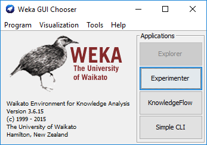
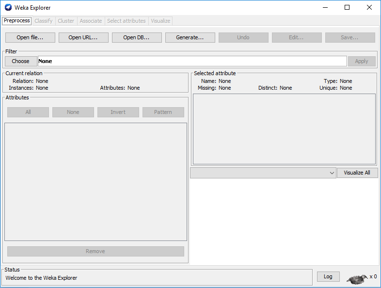
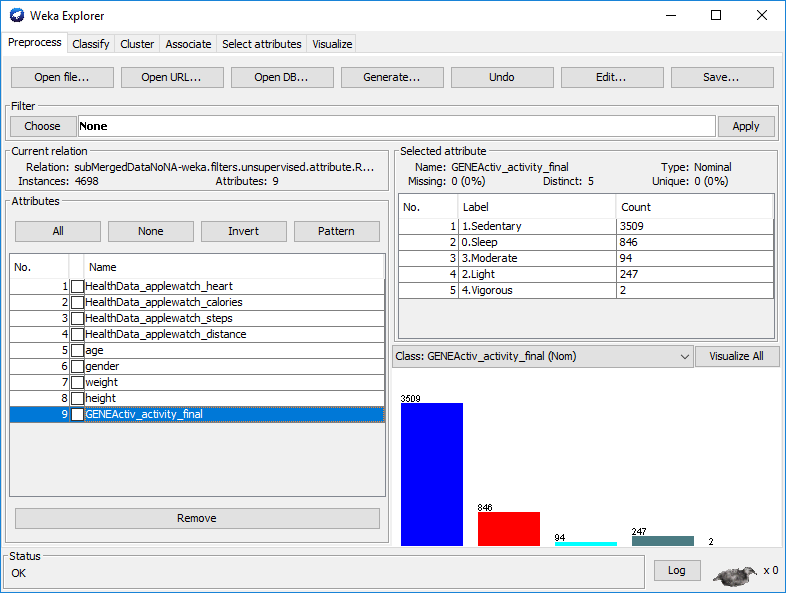
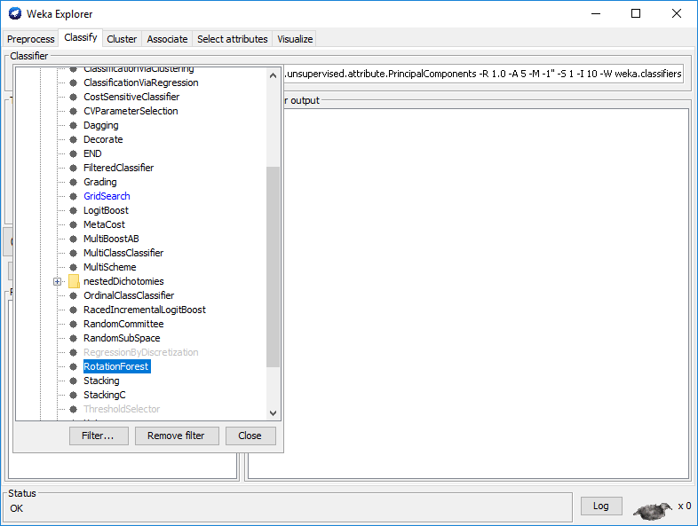
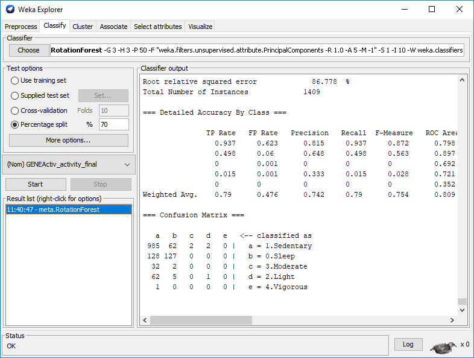

## Authors
* [Javad Rahimipour Anaraki](https://github.com/jracp)
* [Faramarz Dorani](https://github.com/FaramarzDorani)
* [Henry Luan](https://github.com/h3luan)
* Machel Rayner

## Introduction

This document walks you through the all the required steps to extract, clean and process the generated data sourcing from [Ethica](https://www.ethicadata.com/product), [GENEActive (Original)](https://www.activinsights.com/products/geneactiv/), [Apple Watch (S2)](https://www.apple.com/ca/watch/), [Fitbit (Charge 2)](https://www.fitbit.com/en-ca/charge2), and [SenseDoc](http://mobysens.com/en/).

## Preliminaries

There are six (four + one) sub-folders named as follows under a folder called **data**:

* data
    + Ethica
    + GENEActive
    + HealthData (for both Apple Watch and Fitbit)
    + SenseDoc
    + Merged

The **Merged** folder is the one which keeps participant specific merged file, a file containing all participants data with NAs, a file containing all participants data with no NAs in class labels and a file containing all participants data with no NAs at all. The **data** folder also contains a file called **intervals.csv** which stores information about each participants as follows:
 
* `herox` stores participants alias names
* `kit` is the package number
* `phone` is phone id
* `watch` is Apple watch id
* `fitbit` is Fitbit id
* `geneactiv` is GENEActiv id
* `snesedoc` is SenseDoc id
* `start` is start date and time (in ####-##-## ##:##:## format)
* `end` is end date and time (in ####-##-## ##:##:## format)
* `userid` is a unique id for each participant
* `wrist` is 1 if Apple Watch and GENEActiv are on the same wrist, otherwise 0
* `age`, `gender`, `weight` and `height` are demographic data
* `street`, `city`, `postal` are address information for each participant.

**Note**: This file should be kept updated throughout the experiment.

Each device's folder should contain a folder named with `userid` (e.g. 301), and all the extracted data from each device should be stored in each device's folder under `userid`, accordingly (see below example).

* data
    + Ethica
        + 301
            + abc.csv
        + 302
            + def.csv
        + ...
    + GENEActive
        + 301
            + 123.csv
        + 302
            + 456.csv
        + ...
    + ...

Each device's folder contains an R program to clean and prepare the collected data for the main processing step. These programs are shown in the following:

* EthicaDataPrep.R
* GENEActivDataPrep.R
* HealthDataPrep.R
* SenseDocDataPrep.R

## Steps
The whole data processing is divided into four steps as follows:

1. Generating labels
2. Preparing and labeling data
3. Merging all data files
4. Classifying the results

Each step is explained in detail in the following.

### 1. Generating labels
After storing all the extracted data files of each device for a participant, open **GENEActivDataPrep.R** program in R, update the `timezone`, `path`, `intrPath`, and run the program. The results will be stored as an CSV file under each participant id's folder ending with _**labeled.csv**, containing cleaned and labeled GENEActiv data.

**Info**: More information on setting the `timezone` can be found [here](https://en.wikipedia.org/wiki/List_of_tz_database_time_zones). 

### 2. Preparing and labeling data
The labels are ready and we can run the following programs after updating `timezone` and `path` variables for each one.

* EthicaDataPrep.R
* HealthDataPrep.R
* SenseDocDataPrep.R

### 3. Merging all data files
Under **Merged** folder open **merger.R**, update `timezone` and run it to create a file called **finalData.csv** under each participant folder. The generated file contains all the processed data files for each device in second-level from `start` to `end` indicated in **intervals.csv**. The **mergeAllMerged.R** creates three files under **Merged** folder, called **mergedData.csv**, **mergedDataNoNAClass.csv** and **mergedDataNoNA.csv** which contains all participants data with NAs, all participants data with no NAs in class labels and all participants data with no NAs at all, respectively.

### 4. Classifying the results
[Weka](https://www.cs.waikato.ac.nz/ml/weka/) is a ready-to-use machine learning package which has been employed to apply a set of classification methods on the resulting dataset (i.e. **mergedDataNoNA.csv**). Based on the desired setup of data processing, a subset of features/attributes/columns of **mergedDataNoNA.csv** should be selected and stored in a new CSV file (e.g. **subMergedDataNoNA.csv**). For this experiment, we used [Weka version 3.6.15](https://sourceforge.net/projects/weka/files/weka-3-6/3.6.15/).

We used [Rotation Forest](https://ieeexplore.ieee.org/document/1677518) to apply principal component analysis (PCA) and decision tree (J48) classifier to the data using **Explorer**.

To do so, open Weka and click on **Explorer**, click on **Open file...** and browse for **subMergedDataNoNA.csv**.

Then click on **Classify** tab and choose **Rotation Forest** under classifier>meta category. 

In the **Test Options** choose **Percentage split** and modify the percentage to 70%. This way the data is divided into 70% for training and 30% for testing and validation. Click on start button and the results will be shown in Classifier output window as follows.

